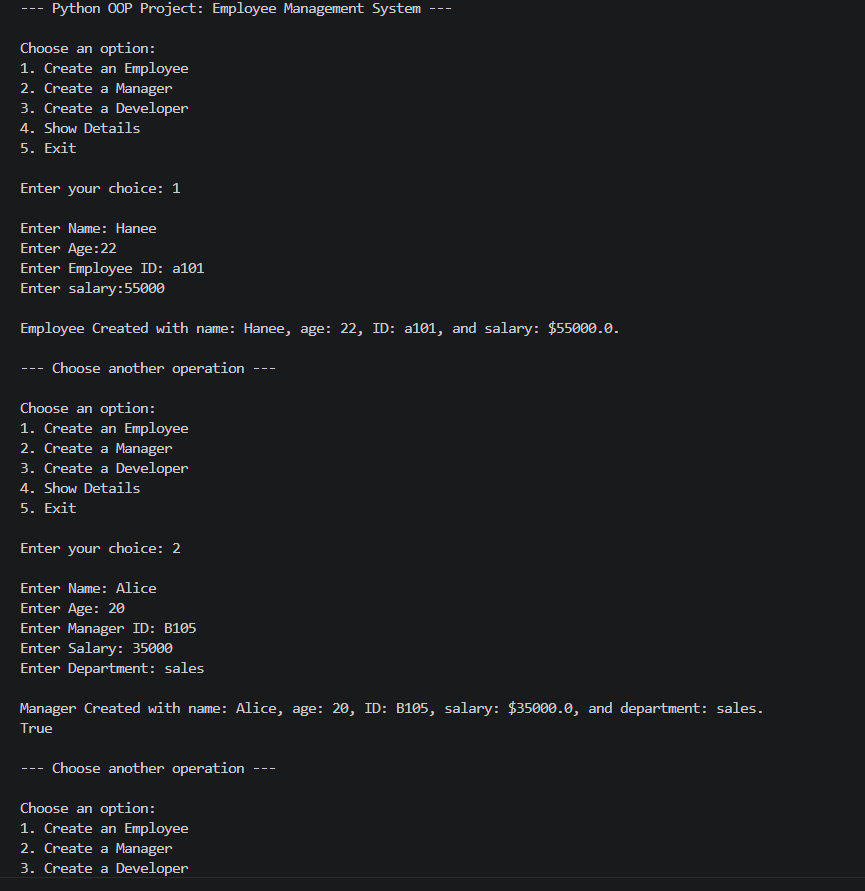
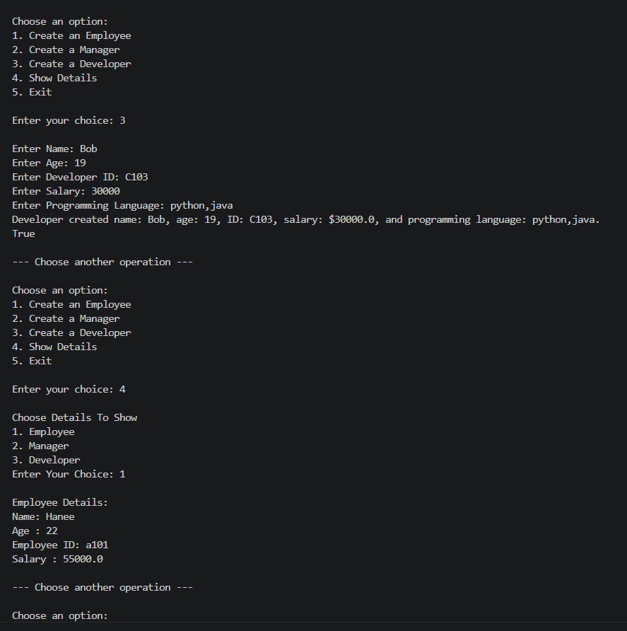
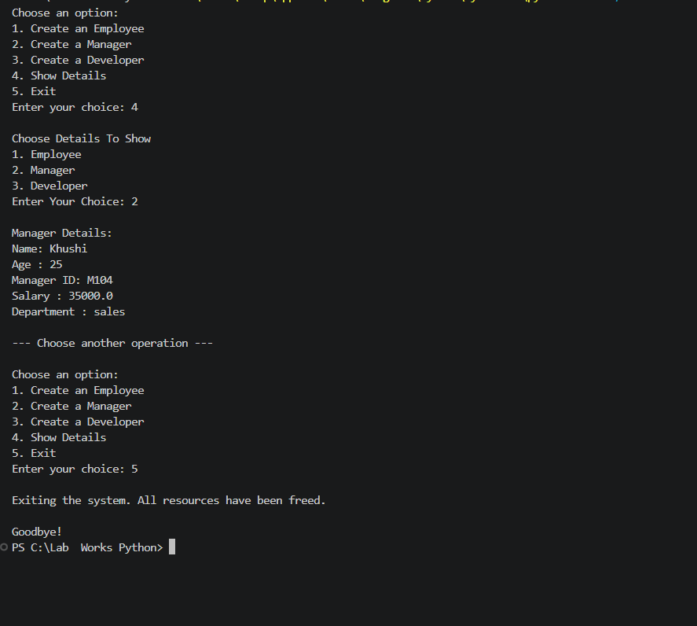

# PR5-Employee-Management-System
# 🏢 Employee Management System (OOP Wrapper)

A Python-based **Employee Management System** developed using **Object-Oriented Programming (OOP)** concepts. This project demonstrates the practical implementation of classes, inheritance, encapsulation, method overriding, constructors, destructors, getters/setters, `super()`, `issubclass()`, and a menu-driven console application.

---

## 📌 Project Objective

The main objective of this project is to build an Employee Management System that manages employee information while demonstrating core Object-Oriented Programming concepts in Python.

The system allows users to:

- Create Employee objects
- Create Manager objects
- Display employee details
- Implement inheritance and method overriding
- Protect sensitive data using encapsulation
- Use constructors and destructors
- Work with getter and setter methods
- Use `super()` and `issubclass()`
- Operate through a menu-driven interface

---

# 🚀 Features

- ✅ Employee Base Class
- ✅ Manager Derived Class
- ✅ Developer Derived Class
- ✅ Constructor (`__init__`)
- ✅ Destructor (`__del__`)
- ✅ Encapsulation using Private Variables
- ✅ Getter & Setter Methods
- ✅ Method Overriding
- ✅ Constructor Overloading (Default Arguments)
- ✅ Inheritance
- ✅ `super()` Implementation
- ✅ `issubclass()` Demonstration
- ✅ Menu Driven Program
- ✅ User-Friendly Console Interface

---

# 📚 OOP Concepts Used

| Concept | Description |
|---------|-------------|
| Class | Employee, Manager, Developer |
| Object | Employee & Manager Objects |
| Constructor | Initialize object data |
| Destructor | Destroy object resources |
| Encapsulation | Private Employee ID & Salary |
| Getter & Setter | Access private variables safely |
| Inheritance | Manager & Developer inherit Employee |
| Method Overriding | display() method |
| Method Overloading | Constructor using default arguments |
| super() | Call Parent Constructor |
| issubclass() | Check Parent-Child Relationship |

---

# 🏗️ Class Structure

## Employee (Base Class)

### Attributes

- Employee ID
- Name
- Age
- Salary

### Methods

- Constructor
- Destructor
- Getter Methods
- Setter Methods
- Display()

---

## Manager (Derived Class)

### Additional Attribute

- Department

### Methods

- Constructor using `super()`
- Overridden `display()`

---

## Developer (Derived Class)

### Additional Attribute

- Programming Language

### Methods

- Constructor using `super()`
- Overridden `display()`

---

# 📂 Project Structure

```
PR-5-Employee-Management-System/
│
├── PR5-employee-management.py
├── README.md
└── output1.png
├── output2.png
├── output3.png
```

---

# 🖥️ Menu Driven Interface

```
1. Create Employee
2. Create Manager
3. Create Developer
4. Show Details
5. Exit
```

---

# 🔒 Encapsulation

Sensitive attributes are declared as private.

- Employee ID
- Salary

These values are accessed using Getter and Setter methods.

Example:

```
set_salary()
get_salary()

set_employee_id()
get_employee_id()
```

---

# 👨‍💼 Inheritance

```
          Employee
         /        \
    Manager     Developer
```

Both derived classes inherit all properties of the Employee class.

---

# 🔄 Method Overriding

The `display()` method is overridden in:

- Manager Class
- Developer Class

Each class displays its own additional information.

---

# ⚙️ Constructor & Destructor

### Constructor

Used for initializing object values automatically.

### Destructor

Used for releasing resources when an object is deleted.

---

# 🧩 super()

The `super()` function is used to call the constructor of the Employee class from the Manager and Developer classes.

Example Usage:

```
super().__init__()
```

---

# ✅ issubclass()

Checks whether Manager and Developer are subclasses of Employee.

Example:

```
issubclass(Manager, Employee)
issubclass(Developer, Employee)
```

---

# ▶️ How to Run

1. Install Python 3.x on your computer.
2. Clone or download this repository.
3. Open the project in Visual Studio Code.
4. Run the following command:

```bash
PR5-employee-management.py
```

---

# 💻 Sample Output





# 📖 Learning Outcomes

After completing this project, you will understand:

- Object-Oriented Programming
- Classes & Objects
- Constructors
- Destructors
- Encapsulation
- Getter & Setter Methods
- Inheritance
- Method Overriding
- Constructor Overloading
- super()
- issubclass()
- Menu Driven Programming

---

# 🛠️ Technologies Used

- Python 3.x
- Object-Oriented Programming (OOP)
- Command Line Interface (CLI)

---

# 🎯 Future Enhancements

- Store employee records in a file
- Add Update Employee option
- Add Delete Employee option
- Search Employee by ID
- 
---

 ## ⭐ Thank You
 
Thank you for visiting this repository.

---
